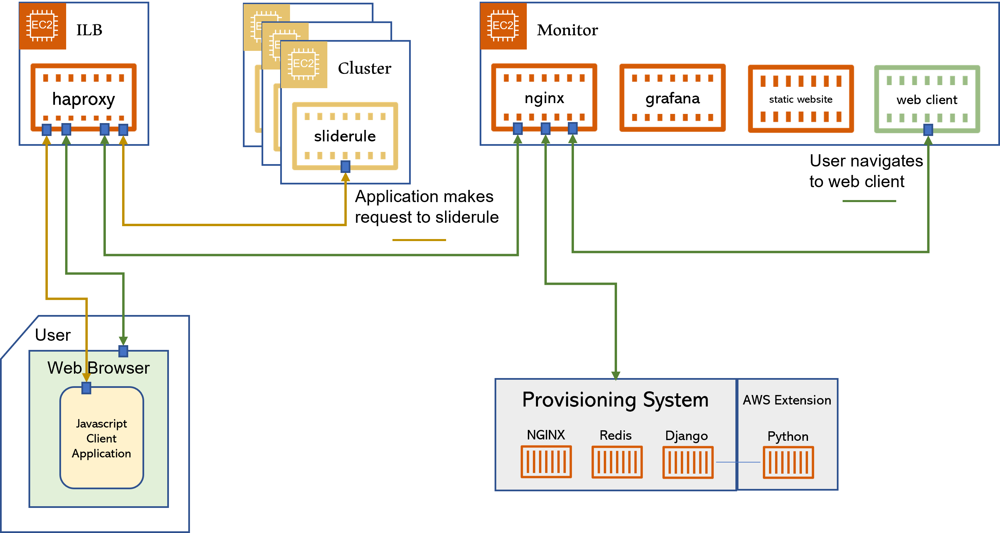

# SlideRule Web Client

## Use Cases

#### #1 - Advanced user

A researcher at the University of Washington, who is intimately familiar with the way the ATL06 algorithm works and the way it has been implemented in SlideRule, wants to explore the effect of different processing parameters over a particularly tricky area of interest.  This exploration will support a currently funded research effort to produce a new science data product.

They upload a shapefile describing their area of interest, which is the immediately outlined on the global map.  They then click through a series of options provided to them on the website to construct the exact processing request they want, hit the "run" button, and wait while SlideRule executes the request.  After a short time the results are displayed on the map inside the outlined area of interest.  They zoom, pan, and take a closer look at those results, utlimately deciding to use the web client to then plot a classified and filtered photon cloud for one of the tracks they have selected on the screen.

#### #2 - Scientist peripherally familiar with SlideRule

A researcher at the University of Maryland, who heard about SlideRule from a presentation at a conference, quickly looks up the url on their laptop and wants to explore what SlideRule is capable of doing.  They click through a few options, draw a quick polygon around their home city, hit the "run" button and quickly see some data come back to them displayed on the screen.

#### #3 - High school student

A student at Roosevelt High School wants to create a vegetation density graphic for a part of the Amazon Rain Forest that they are studying for their end-of-quarter research project.   They spend an afternoon figuring out how to use SlideRule to create an impressive looking plot that shows the deforestation of the Amazon over time.

## High Level Design Description

The SlideRule Web Client is a javascript application that runs in a user's browser after navigating to the the web client's URL.  The web client provides a map-based graphical user interface for making processing requests to SlideRule, and displaying and keeping track of the results returned from SlideRule.

The web client runs in a docker container inside a provisioned SlideRule cluster.  It is reached through the Intelligent Load Balancer (haproxy), and athentication proxy (NGINX), provided by the cluster.

The client will have four main views:
1. A ***beginner*** view - a simple map interface that is intuitive and allows users to quickly access basic features of SlideRule

2. An ***advanced*** view - a feature rich map interface with all of the processing request parameters exposed to the user for advanced SlideRule requests

3. A ***record*** view - a list of recent SlideRule requests along with the results available to replot and interrogate

4. A ***profile*** view - a scatter plot of along track data associated with one of the SlideRule processing requests

## Implementation Considerations

The software should be designed with a modern web framework: Vue.js, AngularJS, React, etc.

The Software should use a robust geospatial library for map functions: OpenLayers, Leaflet, Mapbox, etc.

## Requirements

> **Users** - individuals running the SlideRule Web Client in their browser
>
> **UI** - the user interface taken as a whole, without specifying a particular component
>
> **Map** - the user interface component showing a gobal map
>
> **Profile** - the user interface component showing an along track scatter plot the data

#### SRWC: Execution Environment

The javascript application that makes the processing request to SlideRule and handles the returned data shall run in the user's browser on their computer.

#### SRWC: Area of Interest Selection

(1) The user shall be able to draw a *polygon* on the map to define their area of interest
(2) The user shall be able to draw a *bounding box* on the map to define their area of interest
(3) The user shall be able to upload a *shapefile* on the map to define their area of interest
(4) The user shall be able to upload a *geojson* on the map to define their area of interest
(5) The user shall be able to type/paste a *geojson* string into an input box to define their area of interest

#### SRWC: Basemaps

The map shall support displaying multiple basemaps, to include:
* 3DEP
* ASTER GDEM
* ESRI Imagery
* GLIMS
* RGI

#### SRWC: Projections

The map shall support being displayed in three map projections: north polar, south polar, and plate carree.

#### SRWC: Request Records

Maintain a set of results and request parameters for the most recent N processing runs.  These "saved" processing runs will be referred to as **request records**. 

#### SRWC: Progress Indication

The UI shall provide a processing progress indication for all requests made to SlideRule.

#### SRWC: Result Plotting

The returned data from a SlideRule processing request shall be performantly plotted onto the map and profile: 10M points < 5 seconds.

#### SRWC: Color Map

The data plotted onto the map and profile shall support a user selectable color map.

#### SRWC: Hover Popup

When a user hovers over plotted points, a pop up information panel that provides result-specific data values associated with the plotted point (i.e. latitude, longitude, height, reference ground track, etc.) shall appear.